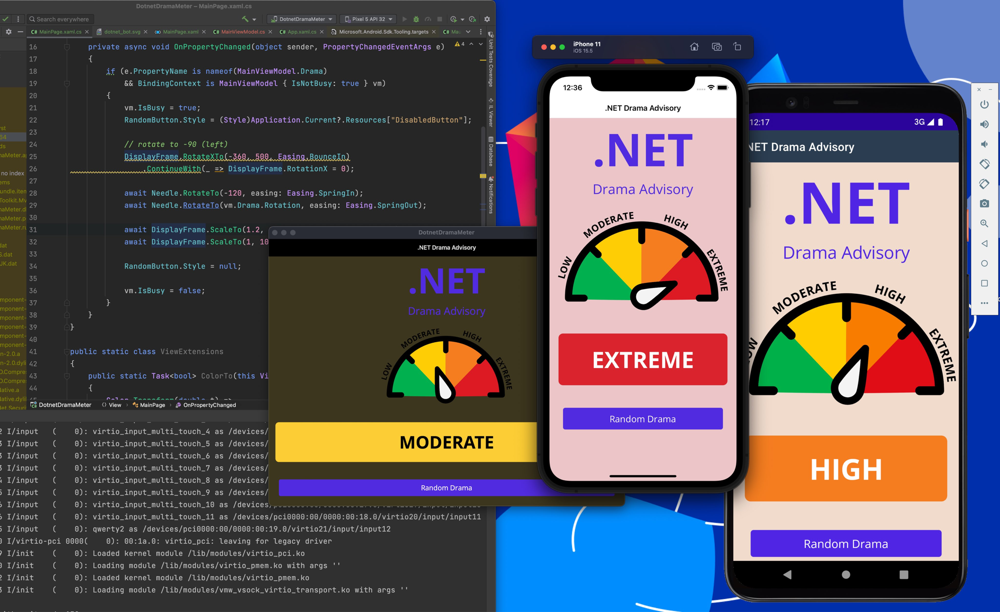

# .NET Drama Meter (MAUI)

A MAUI sample application for the .NET Drama Meter. A simple app that uses MVVM and the animation API of MAUI.

## Getting Started

I recommend reading this [Getting Started post I wrote for JetBrains](https://blog.jetbrains.com/dotnet/2022/05/25/macos-environment-setup-for-maui-development/).

## License

The code is for educational purposes.

## Social Media

If you like my demos and blog posts, be sure to follow me on Twitter [@buhakmeh](https://twitter.com/buhakmeh) and read my blog posts at https://abuhakmeh.com.